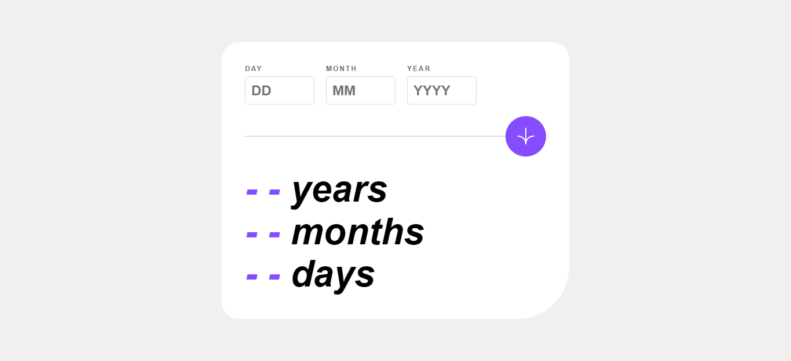

# Frontend Mentor - Age calculator app solution

This is a solution to the [Age calculator app challenge on Frontend Mentor](https://www.frontendmentor.io/challenges/age-calculator-app-dF9DFFpj-Q). Frontend Mentor challenges help you improve your coding skills by building realistic projects.

## Table of contents

- [Overview](#overview)
  - [The challenge](#the-challenge)
  - [Screenshot](#screenshot)
  - [Links](#links)
- [My process](#my-process)
  - [Built with](#built-with)
  - [What I learned](#what-i-learned)
  - [Continued development](#continued-development)
- [Author](#author)

## Overview

### The challenge

Users should be able to:

- View an age in years, months, and days after submitting a valid date through the form
- Receive validation errors if:
  - Any field is empty when the form is submitted
  - The day number is not between 1-31
  - The month number is not between 1-12
  - The year is in the future
  - The date is invalid e.g. 31/04/1991 (there are 30 days in April)
- View the optimal layout for the interface depending on their device's screen size
- See hover and focus states for all interactive elements on the page
- **Bonus**: See the age numbers animate to their final number when the form is submitted

### Screenshot



### Links

- Solution URL: [https://github.com/LeonardoR3D/frontend-mentor-challenge-003.git]
- Live Site URL: [https://leonardor3d.github.io/FMC-03-Age-Calculator-App/]

## My process

### Built with

- Semantic HTML5 markup
- CSS custom properties
- Flexbox
- Mobile-first workflow

### What I learned

I have learned how to change inputs using webkit and moz

```css
/* Removes arrows in numeric inputs */
input::-webkit-outer-spin-button,
input::-webkit-inner-spin-button {
  -webkit-appearance: none;
  margin: 0;
}
input[type="number"] {
  -moz-appearance: textfield;
  appearance: textfield;
}

/* Removes background color when interacting on mobile devices */
input,
textarea,
button,
select,
a {
  -webkit-tap-highlight-color: transparent;
}
```

I have learned to prevent inputs from accepting some specific values.

```js
// . Constraining numbers in the inputs
[inputDay, inputMonth].forEach((input) => {
  input.setAttribute(
    "oninput",
    "this.value = this.value.replace(/[^0-9]/g, '').substring(0, 2);"
  );
});

inputYear.setAttribute(
  "oninput",
  "this.value = this.value.replace(/[^0-9]/g, '').substring(0, 4);"
);
```

### Continued development

Since I did not complete the bonus of this challenge, I will try to add more emphasis on the animations of the next challenge.

## Author

- Frontend Mentor - [@LeonardoR3D](https://www.frontendmentor.io/profile/LeonardoR3D)
- Twitter - [@Crazy9_3D](https://twitter.com/Crazy9_3D)
